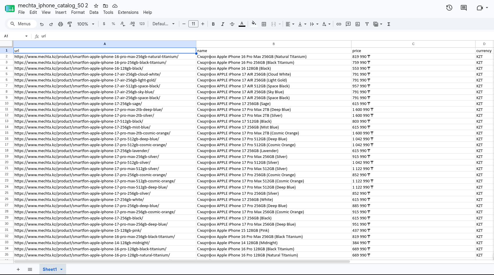

# E-commerce Catalog Scraper

Collects a product catalog from a bot-protected e-commerce site: opens a real
browser, works through the category pages, and writes a clean spreadsheet with
product URL, name, price and currency.



## What it collects

| Field | Description |
|---|---|
| url | Direct link to the product page |
| name | Product title, store suffixes stripped out |
| price | Listed price as shown on the card |
| currency | `KZT` when the price carries the currency symbol, otherwise `N/A` |

## How it works

The site renders prices with JavaScript and loads product cards lazily, so a
plain HTTP request returns an empty shell. The scraper drives a real browser
instead: it scrolls the page in steps with randomized pauses so the cards
actually render, then hands the resulting HTML to BeautifulSoup.

Cards are matched by product-link prefix rather than by class names, since
utility class names on this kind of site change often while URL structure
stays stable. The price is taken from the nearest sibling span carrying the
currency symbol.

Duplicates are dropped twice: within a page while parsing, and across pages
against the set of URLs already collected. Query strings are stripped from
URLs first, so the same product arriving with different tracking parameters
still counts once.

Progress is written to the output file every 10 items, so a long run that dies
halfway leaves usable data behind instead of nothing.

## Stack

Python · Selenium · BeautifulSoup · pandas · openpyxl

## Installation

```bash
git clone https://github.com/VanguardXs/ecommerce-scraper.git
cd ecommerce-scraper
pip install -r requirements.txt
```

Chrome or Chromium needs to be installed. The binary is located automatically;
`CHROME_BINARY` overrides the path if needed.

## Usage

The run is configured at the top of `catalog_scraper.py`:

```python
CATEGORY_URL = "https://..."
LIMIT = 50
OUT_FILE = "catalog.xlsx"
```

Then:

```bash
python catalog_scraper.py
```

The browser opens and the script waits. Once the page shows products, press
Enter in the terminal and collection starts.

## Notes

The target site sits behind Cloudflare. The scraper opens a real browser with a
persistent profile and pauses for a manual verification step on the first run,
so the cookies carry over to later runs. Protection on the site has been
tightened since this was written, so an unattended run is no longer reliable.

Selectors are tied to the current markup and will need updating when the site
changes its layout.

## License

Released under the [MIT License](LICENSE).
